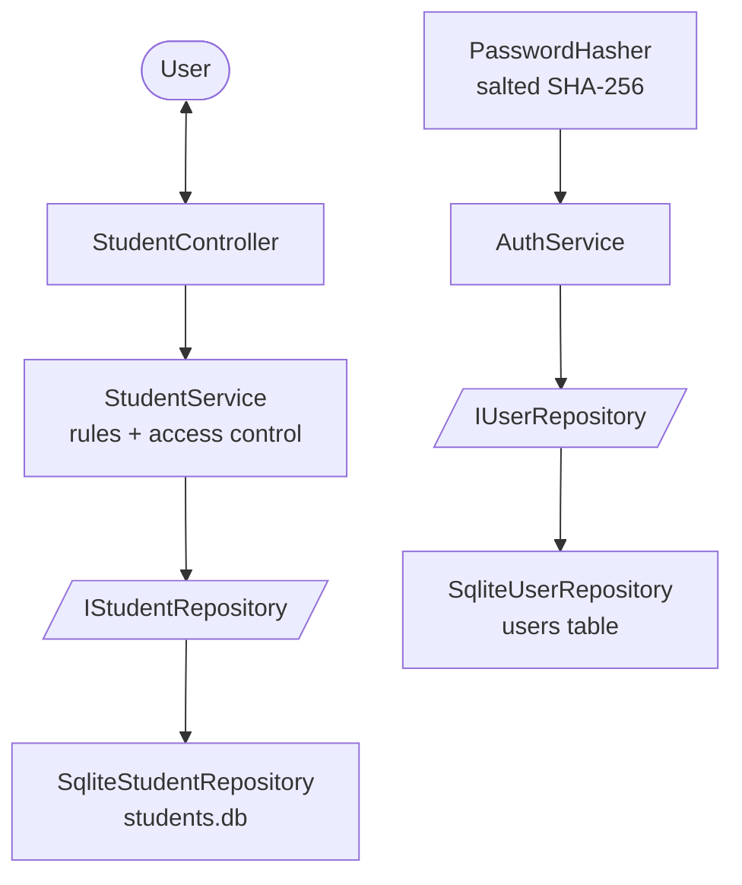

# Enhancement Three Narrative — Databases

**Course:** CS-499 Computer Science Capstone — Southern New Hampshire University
**Student:** Emily Cruz
**Category:** Databases (Module Five)
**Artifact:** Student Portal (C++)

## Description and Origin of the Artifact

The artifact is the **Student Portal**, the same C++ console application enhanced
across all three capstone categories. After Module Three (Software Design) it used
a layered Controller / Service / Repository architecture, and after Module Four
(Algorithms and Data Structures) its in-memory repository used binary search over
a sorted vector. In both of those versions the data lived only in memory and was
lost when the program closed. This third enhancement targets the **Databases**
category: it moves storage into a real relational database and builds the
operations a database makes possible — full CRUD, criteria-based search and
ordering, reports, and user access levels.

## Justification for Inclusion

The portal is a natural fit for a database enhancement because a student
information system is fundamentally about persistent, queryable records. The
enhancement adds five capabilities, each of which compiles and stands on its own:

1. **Persistent SQLite repository with parameterized queries.** A new
   `SqliteStudentRepository` implements the existing `IStudentRepository`
   interface and stores records in `students.db`. Every statement is prepared and
   bound (`sqlite3_prepare_v2` + `sqlite3_bind_*`); no value is ever concatenated
   into SQL text, which prevents SQL injection. The database path is injected
   rather than hardcoded.
2. **Full CRUD.** `update` and `remove` are added to the repository interface and
   implemented in both the SQLite and in-memory repositories. The service rejects
   updates or deletes for an id that does not exist.
3. **Criteria search and ordering.** `findByName` uses a parameterized `LIKE`
   query; `findByGpaRange` uses `WHERE gpa BETWEEN ? AND ? ORDER BY gpa DESC`. The
   database performs the filtering and ordering.
4. **Reports / views.** A Dean's List (GPA at or above a threshold), a total
   count, and an average GPA, computed with SQL `COUNT` and `AVG` rather than
   pulling all rows into the program.
5. **Access levels.** A `users` table stores salted password hashes and a role.
   Login runs at startup, and write operations are restricted to administrators.

### Why SQLite, and how it relates to MySQL

This enhancement uses **SQLite** rather than a client/server engine such as MySQL.
SQLite is a full relational database: it speaks SQL, supports prepared statements
and transactions, and enforces schema and types. It is embedded and file-based, so
it requires no separate server process, which makes the portal self-contained and
reproducible. The skills the Databases category targets — schema design,
parameterized queries, CRUD, aggregate reporting, and protecting against SQL
injection — are demonstrated identically. The prepared-statement pattern used here
maps directly to MySQL's Connector/C++ (`prepare`, bind parameters, execute); a
`MySqlStudentRepository` could replace `SqliteStudentRepository` behind the same
`IStudentRepository` interface without changing the service or the controller.

### Architecture (unchanged contract)



## Security (Outcome 5)

Security is the central thread of this enhancement:

- **SQL injection prevention.** All queries are parameterized. User-supplied
  values, including the login username and the name search term, are bound as data
  and can never be interpreted as SQL.
- **Password storage.** Passwords are never stored in plaintext. Each user has a
  unique random salt, and the database stores `SHA-256(salt + password)` computed
  with OpenSSL. A production system would use a slow, memory-hard function such as
  bcrypt or Argon2; SHA-256 with a per-user salt is used here to demonstrate the
  salting-and-hashing principle within the scope of the course.
- **Role-based access control, enforced in the service.** The rule that only an
  administrator may add, update, or delete is enforced in `StudentService`, not
  only by hiding menu options. The controller marks admin-only options for the
  user, but the authoritative check lives in the business layer so the rule holds
  regardless of how the operation is reached.
- **No hardcoded secrets.** The database location is configuration, not a literal
  buried in logic.

## Defects / Limitations Addressed

| Before (M3/M4) | After (M5) |
| --- | --- |
| Data lost on exit (in memory only) | Persistent in `students.db` |
| No update or delete | Full CRUD through the interface |
| Search only by exact id | Search by partial name and by GPA range |
| No reporting | Dean's List, count, average via SQL aggregates |
| No authentication or authorization | Login + salted password hashes + role-based access |

## Reflection — Course Outcomes

This enhancement supports Outcome 4 (using well-founded techniques, skills, and
tools) and, primarily, Outcome 5 (a security mindset that anticipates adversarial
conditions). The design keeps the database behind the `IStudentRepository`
interface established in Module Three, which is what allows persistence to be added
without modifying the service or the controller, and which would allow a MySQL
implementation to be substituted later. Placing authorization in the service
rather than the user interface reflects the principle that security controls
belong at the boundary that cannot be bypassed. Parameterized statements and
salted password hashing apply established practices for preventing injection and
protecting credentials.

## How to Build and Run

Requires SQLite and OpenSSL development libraries (`libsqlite3-dev`, `libssl-dev`).

```bash
cd artifact/enhanced
make            # links -lsqlite3 -lcrypto
./student_app
```

On first run the program seeds two accounts: `admin` / `admin123` (read-write) and
`user` / `user123` (read-only). Data is saved to `students.db` and persists between
runs.

## Acknowledgment of AI Tool Use

In accordance with SNHU's STEM AI Guidelines for Programming Courses, I
acknowledge the use of Claude (Anthropic) as a brainstorming, debugging, and
code-review aid during this enhancement. The tool was used to discuss database and
security design options, explain C++ and SQLite concepts, review code I wrote, and
help organize this narrative. All code, design decisions, and conclusions are my
own work. The AI tool did not generate the core logic of the implementation, and
all content was reviewed and verified before submission.
