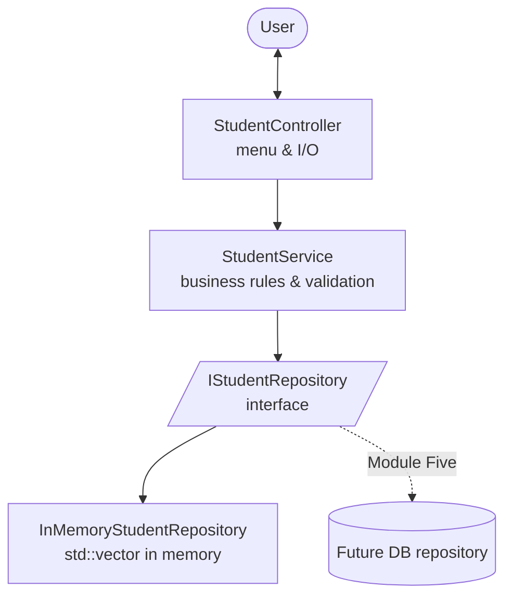

# Enhancement One Narrative — Software Design and Engineering

**Course:** CS-499 Computer Science Capstone — Southern New Hampshire University
**Student:** Emily Cruz
**Category:** Software Design and Engineering (Module Three)
**Artifact:** Student Portal (C++)

## Description and Origin of the Artifact

The artifact is the **Student Portal**, a C++ console application originally
provided as starter code by Dr. Bolton for CS-499 (Option B: Medical/Student
Information Portal). In its baseline form (`artifact/original/`) the program is a
small "Student Information System" that lets a user add students, search a student
by ID, and display all students. The data lives only in memory.

The same artifact is being enhanced across all three capstone categories. This
narrative covers the **first enhancement: Software Design and Engineering**. The
enhanced version lives in `artifact/enhanced/` so the original is preserved for a
clear before/after comparison.

## Justification for Inclusion

I selected this artifact for the Software Design and Engineering category because
the baseline was a single, monolithic `main.cpp` where the user interface, the
data storage, and the (missing) validation were all tangled together. That made
it a strong candidate to demonstrate **architectural design skills** by
restructuring it into a clean, layered design.

The enhancement showcases:

- **Layered architecture — Controller / Service / Repository.** Responsibilities
  are now separated. The `StudentController` handles all user interaction, the
  `StudentService` holds the business rules and validation, and the
  `IStudentRepository` defines how data is stored and retrieved.
- **The Repository pattern with an interface (`IStudentRepository`).** The current
  implementation, `InMemoryStudentRepository`, keeps the data in a `std::vector`
  in memory — exactly the way the original program stored it. This is intentional:
  the **real database belongs to a later enhancement (Module Five — Databases)**.
  Because storage sits behind an interface, that future database implementation
  can be swapped in without changing the service or the controller.
- **Dependency injection.** `main.cpp` is the single place that wires the layers
  together (repository → service → controller). It is the only location that needs
  to change when the in-memory repository is later replaced by a database-backed
  one.
- **Encapsulation.** The `Student` model now has private data members with `const`
  getters, fixing the encapsulation violation in the original.
- **Memory safety (security mindset).** The baseline used raw `new` without ever
  calling `delete`, leaking memory. The enhanced version uses value semantics
  (`std::vector<Student>`), so there are no manual allocations and no leaks.
- **Input validation (security mindset).** The service rejects negative IDs, empty
  names, GPAs outside the 0.0–4.0 range, and duplicate IDs — none of which the
  baseline checked.

### Architecture diagram



## Defects Corrected

Beyond the architectural redesign, the enhancement fixes the concrete defects
that were marked in the baseline:

| Baseline issue | Fix in the enhanced version |
| --- | --- |
| Public data members (`student.h`) | Private members + `const` getters |
| Constructor did not validate data | Validation centralized in `StudentService` |
| `printDetails` had no formatting | Labeled, fixed-precision output |
| Memory leak from raw `new` | Value semantics (`std::vector<Student>`) |
| Search only checked the first item | `findById` iterates the whole collection |
| Off-by-one (`i <= size()`) out-of-bounds in "display all" | Range-based loop + empty check |
| Invalid menu input could loop forever | Stream error handling in the menu loop |

## Reflection — Course Outcomes and What I Learned

Working through this enhancement helped me meet the outcomes related to **using
well-founded techniques and tools in computing practices (Outcome 4)** and
building a **security mindset (Outcome 5)**. Designing to an interface, rather than
to a concrete storage mechanism, was the part that taught me the most: once the
repository was hidden behind `IStudentRepository`, the rest of the code stopped
caring about *how* data is stored, which is exactly what will let me drop in a
database in Module Five without rewriting the program.

The biggest challenge was deciding where each responsibility belonged — for
example, keeping all validation in the service instead of scattering checks
across the controller and the model. Drawing the architecture as layers first,
then moving code into the layer it belonged to, made that decision much clearer.

## How to Build and Run

```bash
cd artifact/enhanced
make            # or: g++ -std=c++17 *.cpp -o student_app
./student_app
```
